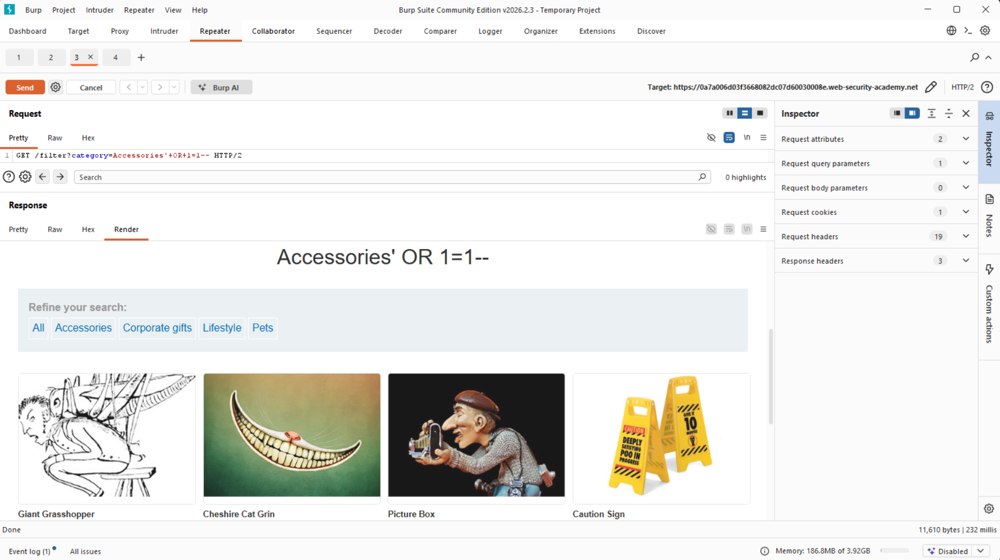

# Lab: SQL injection vulnerability in WHERE clause allowing retrieval of hidden data

**Platform:** PortSwigger Web Security Academy
**Category:** SQL Injection
**Difficulty:** Apprentice

## 🎯 Objective
The application contains a SQL injection vulnerability in the product category filter. The goal is to perform a SQL injection attack that bypasses the filter and causes the application to display one or more unreleased products.

## 🕵️‍♂️ Analysis
When clicking on a category like "Accessories", the application makes a `GET` request with the parameter `category=Accessories`. The backend likely executes a query similar to:
`SELECT * FROM products WHERE category = 'Accessories' AND released = 1`

The `category` parameter does not sanitize single quotes, allowing us to break out of the intended string.

## 🚀 Payload & Execution
To bypass the `AND released = 1` condition, I injected a mathematically true OR statement and commented out the rest of the query.

**Payload:** `' OR 1=1--`

### Steps:
1. Intercepted the category filter request using Burp Suite.
2. Sent the request to Repeater.
3. Modified the `category` parameter to include the URL-encoded payload: 
   `GET /filter?category=Accessories'+OR+1=1-- HTTP/2`
4. Forwarded the request. The `1=1` condition forced the database to evaluate the WHERE clause as true for every row, returning all products, including unreleased ones.

## 📸 Proof of Concept

