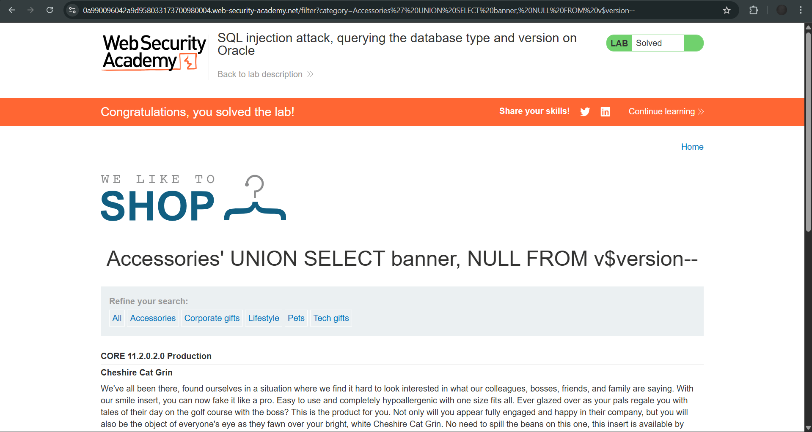

# Lab: SQL injection attack, querying the database type and version on Oracle

**Platform:** PortSwigger Web Security Academy
**Category:** SQL Injection
**Difficulty:** Apprentice

## 🎯 Objective
The application contains a SQL injection vulnerability in the product category filter. The goal is to use a `UNION` attack to display the database version string, specifically exploiting Oracle database syntax.

## 🕵️‍♂️ Analysis
The `category` parameter is vulnerable to SQL injection. Because I need to retrieve data from a completely different table (the database version) and display it on the page, a `UNION SELECT` attack is required. 

Oracle databases have strict syntax rules:
1. Every `SELECT` statement must include a `FROM` clause. To test the number of columns, the built-in dummy table `dual` must be used.
2. The database version string is stored in the `banner` column of the `v$version` system view.

## 🚀 Payload & Execution
First, I determined the original query returns two columns by injecting `NULL` values until the application loaded without an error. 

**Column Testing Payload:** `' UNION SELECT NULL, NULL FROM dual--`

Once I confirmed there were two columns and they could accept text data, I swapped the first `NULL` for the `banner` column and pointed the `FROM` clause to the `v$version` table.

**Final Payload:** `' UNION SELECT banner, NULL FROM v$version--`

### Steps:
1. Intercepted the category filter `GET` request.
2. Injected the final payload into the `category` parameter, ensuring spaces were URL-encoded.
   `GET /filter?category=Accessories'+UNION+SELECT+banner,+NULL+FROM+v$version-- HTTP/2`
3. Forwarded the request. The application returned the contents of the `banner` column, revealing the Oracle database version directly on the webpage among the product listings.

## 📸 Proof of Concept

