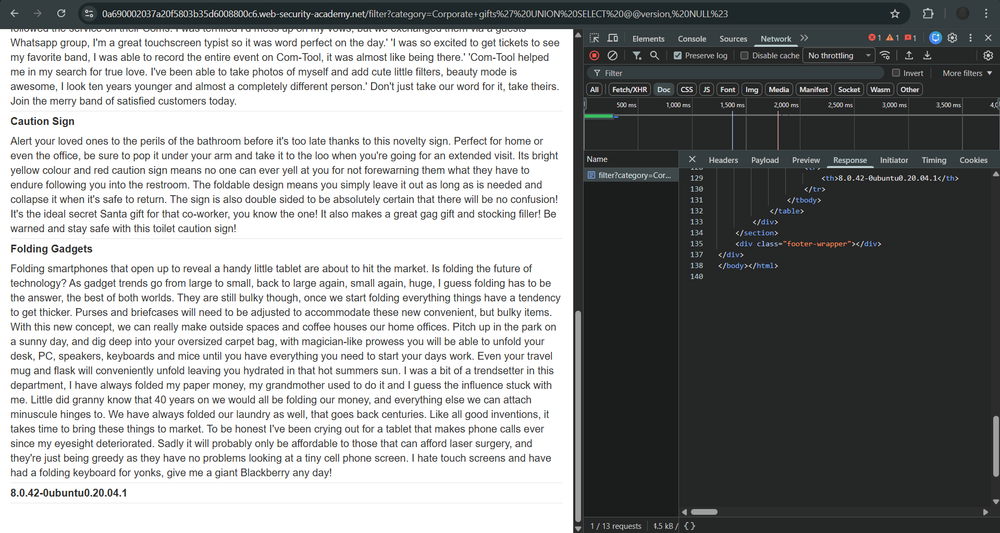

# Lab: SQL injection attack, querying the database type and version on MySQL and Microsoft

**Platform:** PortSwigger Web Security Academy  
**Category:** SQL Injection  
**Difficulty:** Apprentice  

## 🎯 Objective
The application contains a SQL injection vulnerability in the product category filter. The goal is to use a `UNION` attack to display the database version string, specifically targeting a MySQL or Microsoft database environment.

## 🕵️‍♂️ Analysis
The `category` parameter is vulnerable to SQL injection. To retrieve the database version and display it on the page, a `UNION SELECT` attack must be used. 

Unlike Oracle, MySQL and Microsoft databases do not require a dummy table (like `dual`) to execute a `SELECT` statement. The version string can be extracted using `@@version`. 

Additionally, MySQL handles comments differently. While `-- ` (dash-dash-space) works, trailing spaces are often stripped in URLs, causing syntax errors. Therefore, it is much safer to use the hash symbol `#` (URL-encoded as `%23`) to comment out the remainder of the query.

## 🚀 Payload & Execution
First, I determined the original query expects two columns by injecting `NULL` values. 

**Column Testing Payload:** `' UNION SELECT NULL, NULL#`
*(URL Encoded: `%27%20UNION%20SELECT%20NULL,%20NULL%23`)*

Once the column count was confirmed, I replaced the first `NULL` with the database version variable `@@version`.

**Final Payload:** `' UNION SELECT @@version, NULL#`

### Steps:
1. Identified the vulnerable `category` parameter in the `GET` request.
2. Injected the final payload directly into the URL, ensuring spaces and the `#` comment symbol were properly URL-encoded.
   `GET /filter?category=Corporate+gifts%27%20UNION%20SELECT%20@@version,%20NULL%23 HTTP/2`
3. The database executed the injected `UNION` statement and returned the version string (`8.0.42-0ubuntu0.20.04.1`), displaying it directly on the webpage.

## 📸 Proof of Concept

