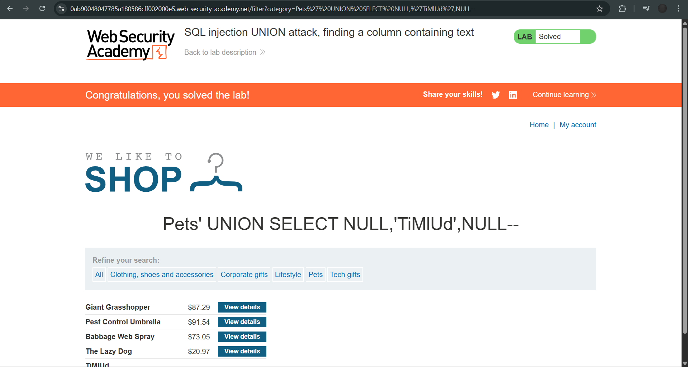

# Lab: SQL injection UNION attack, finding a column containing text

**Platform:** PortSwigger Web Security Academy
**Category:** SQL Injection
**Difficulty:** Apprentice

## 🎯 Objective
The application contains a SQL injection vulnerability in the product category filter. The goal is to determine the number of columns returned by the query, identify which of those columns are compatible with string data, and use a `UNION` attack to output a specific provided string (`TiMlUd`) onto the page.

## 🕵️‍♂️ Analysis
A successful `UNION` attack requires two conditions to be met:
1. The injected query must return the same number of columns as the original query.
2. The data types of the corresponding columns must be compatible. 

Once the column count is established using `NULL` values, I systematically replace each `NULL` with a string value to test which columns are configured to handle text. If a column expects an integer and I inject a string, the database will throw an error.

## 🚀 Payload & Execution
I targeted the `category` parameter to execute a two-step enumeration phase.

### Step 1: Determine Column Count
I incrementally injected `NULL` values until the application loaded without an error.
* **Payload:** `' UNION SELECT NULL, NULL, NULL--`
* **Result:** The page loaded normally, confirming the original query returns exactly 3 columns.

### Step 2: Probe for String Compatibility
I tested each of the three columns to see which one could accept the required target string (`TiMlUd`).
* **Test Column 1:** `' UNION SELECT 'TiMlUd', NULL, NULL--` (Result: Error)
* **Test Column 2:** `' UNION SELECT NULL, 'TiMlUd', NULL--`
* *(URL Encoded: `%27%20UNION%20SELECT%20NULL,%27TiMlUd%27,NULL--`)*
* **Result:** The page loaded successfully and displayed the string `TiMlUd` inside the HTML response, proving the second column is compatible with string data and solving the lab.

## 📸 Proof of Concept
*(Add your screenshot showing the string TiMlUd rendered on the page here)*

