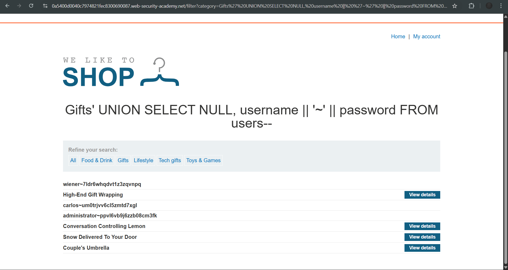

# Lab: SQL injection UNION attack, retrieving multiple values in a single column

**Platform:** PortSwigger Web Security Academy
**Category:** SQL Injection
**Difficulty:** Practitioner

## 🎯 Objective
The application contains a SQL injection vulnerability in the product category filter. The goal is to retrieve all usernames and passwords from the `users` table and log in as the `administrator`. The challenge is that only one column in the original query results is compatible with string data.

## 🕵️‍♂️ Analysis
Through initial enumeration (`' UNION SELECT NULL, NULL--`), I determined the original query returns two columns. However, only the second column accepts string data. 

Because we need to extract two separate fields (`username` and `password`) but only have one valid string column to output data into, we must use **string concatenation**. This allows us to merge the contents of both columns into a single string, separated by a delimiter (like `~`), so they can be extracted simultaneously in one payload.

## 🚀 Payload & Execution
I targeted the `category` parameter and used the double pipe `||` concatenation operator (standard in PostgreSQL/Oracle/SQLite) to combine the fields.

### The Concatenation Method (Optimal)
* **Payload:** `' UNION SELECT NULL, username || '~' || password FROM users--`
* *(URL Encoded: `%27%20UNION%20SELECT%20NULL,%20username%20||%20%27~%27%20||%20password%20FROM%20users--`)*
* **Result:** The application loaded successfully, dumping the credentials in a single line format (e.g., `administrator~chz5otn0vy750g96qz79`).

### The Two-Step Method (Alternative)
It is also possible to extract the data by running two separate queries and manually matching the results, though this is less efficient for large databases.
1. Dump Usernames: `' UNION SELECT NULL, username FROM users--`
2. Dump Passwords: `' UNION SELECT NULL, password FROM users--`

Using the extracted credentials, I logged into the `administrator` account to solve the lab.

## 📸 Proof of Concept

