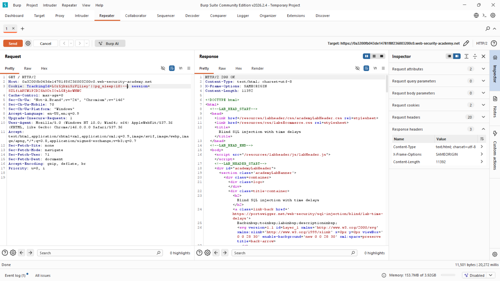

# Lab: Blind SQL injection with time delays

**Platform:** PortSwigger Web Security Academy  
**Category:** SQL Injection  
**Difficulty:** Practitioner

## 🎯 Objective
The application contains a blind SQL injection vulnerability in the tracking cookie. The application does not return data, does not change its response based on boolean logic, and catches all database errors. The goal is to prove the vulnerability exists by forcing the database to pause execution for exactly 10 seconds.

## 🕵️‍♂️ Analysis
When an application is completely blind (no conditional text, no visible errors, and no conditional errors), we must rely on **Time-Based Inference**. Because the backend query is executed synchronously, the web server will not send an HTTP response to our browser until the database finishes executing the query. 

By injecting a database-specific sleep function, we can force the query to pause. If the response takes 10 seconds to return, we have confirmed the injection.

Because we are injecting into a string-based `WHERE` clause, we cannot simply append the sleep command. We must use string concatenation (`||`) to glue our function into the existing query logic, forcing the database to execute the sleep function while it attempts to build the final string.

## 🚀 Payload & Execution
I targeted the `TrackingId` cookie. To determine the database dialect, I tested standard sleep functions. The PostgreSQL payload was successful on the first attempt.

### Steps:
1. Intercepted a request containing the tracking cookie in Burp Suite Repeater.
2. Appended the PostgreSQL sleep payload using concatenation pipes.
   * **Payload:** `TrackingId=xyz'||pg_sleep(10)--`
3. Sent the request and monitored the response time in the bottom right corner of Burp Repeater.
4. **Result:** The server took ~10,000 milliseconds (10 seconds) to return the standard `200 OK` response, confirming the vulnerability and solving the lab.

## 📸 Proof of Concept

